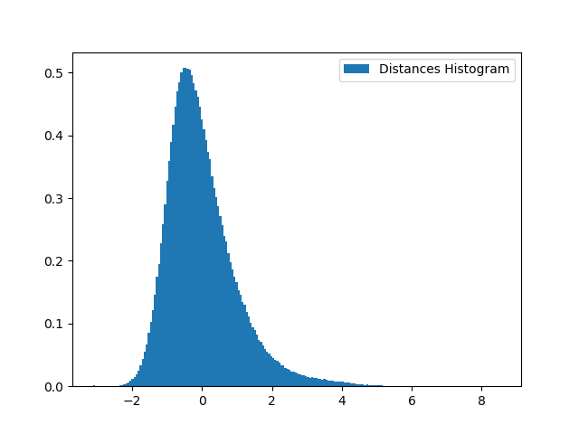
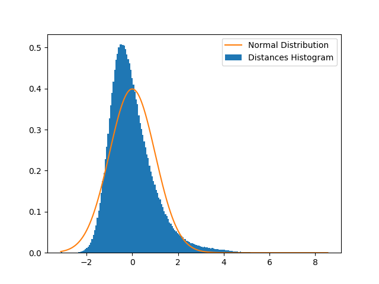
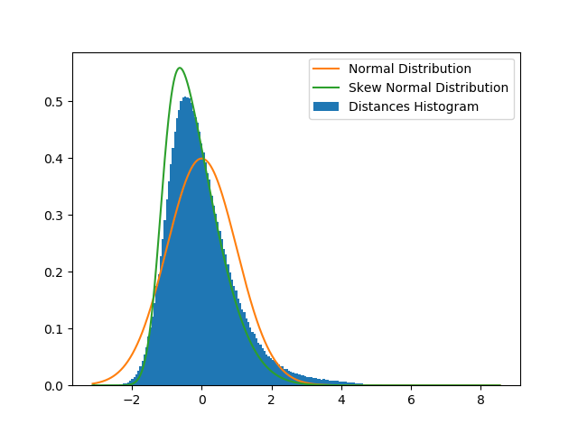
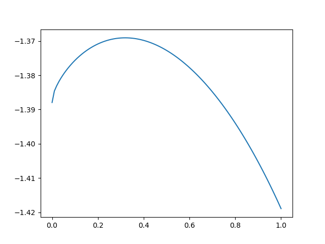
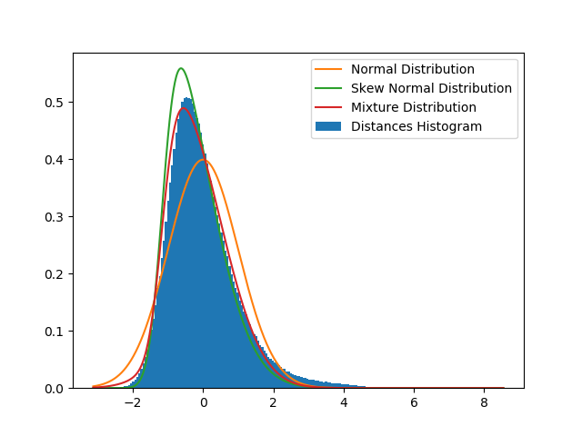

## Advertisement Similarity Detection

#### Problem Definition: 
Below is illustration of some duplicate advertisements which should be detected. (from now on I will use __item__ instead of __advertisement__)
The task is completely unsupervised and we have no labeled data of any similar items. 

An Item | A Duplicate
------------ | -------------
 | 
 | 


Existence of similar items and showing them in the
same time to the user will harm advertising system's quality and
effectiveness.

#### A Naive Method:
To find similar image a trivial idea is to compute
L2 distance between images and if the distance is lower than
some threshold mark them as duplicates. This trivial method will cause
pool results because by changing point of view, objects position, and image contrast
the L2 distance will change significantly.
Below figures shows the closest image w.r.t Euclidean distance between two image.

An Item | Closest Item
------------ | -------------
 | 
 | 


We see that L2 distance between images can produce rubbish results!
As you see closest image to top view of a head is a bride and broom
walking on a green field! (Perhaps because both images have a white area in the center.)

So can we do better? If we could transform each image to an space which closer points 
have similar characteristics then we can use L2 distance in transformed space and expect
better results.

#### Transforming Image Into meaningful space:
The idea is to use some pretrained neural network! I have used VGG19.
This network was trained on ImageNet dataset which consists of nearly 14 million images
which are labeled among 1000 different categories.
Some of these images are shown below


VGG19 is one of the networks that was trained on this dataset to find category of 
each image. This network consists of some convolutional layers and 2 fully connected 
layer at the end, and a softmax layer to predict probabilities on each class. 


This network takes an image and do some transformations on that and goes forward to
reach the last layer which is a probability distribution on 1000 classes. As the
network learns to find the correct class for each images it learns to transform 
images into meaningful spaces. I reshaped each image to (300 * x), maintaining it's aspect
ratio and then center cropped each to obtain a (224 * 224 * 3) image.(3 relates to "RGB" channel)
VGG network takes an image and do some operations on it. input image is a (224 * 224 * 3)
tensor and for example output of the last max pooling layer is (7 * 7 * 512) tensor.
Two last fully connected layers are vector of 4096 elements, it means that each image
is transformed into a 4096 dimensional space at last fully connected layers.

So for each image we have output of different layers in VGG19 network which each regards
to a transformation of image. I have used last three layers (max_pool5, FC1, FC2) which are
(7 * 7 * 512), (4096), (4096) dimensional vectors.

Can we expect that using L2 distance in these new spaces work better than normal L2 distance
between images? The answer is __Yes__

Below tabel shows the closest images to shoe, hair, and car pictures, in terms of L2 Distance in
__primary, max_pool5, FC1, FC2__ spaces.

Space | Shoe Item | Hair Item |  Car Item
------------ | ------------ | ------------- | -------------
Image |  |  | 
Closest in Primary space |  |  | 
Closest in Pool5 space|  |  | 
Closest in FC1 space|  |  |  
Closest in FC2 space|  |  | 


As you can see distances in FC2 space is meaningful and images which have lower distance 
are related from human point of view! (Images which have lower distance in primary space
are related from pixels point of view!)

#### Assigning a Number to Similarity of Two Image:
We see that distances in transformed space is meaningful. Now he we
can assign a number in [0, 1] interval to each pair of images to show their similarity.
(Zero regards to no similarity and One regards to the highest similarity)

The idea is to estimate the distribution of image distances in FC2 space.
Our dataset contains about 14K image but I am using only 10% of the data to estimate
the distribution (due to the time complexity which is O(n<sup>2</sup>)!)

calculating distances between these images and plotting the histogram will lead
to the following figure
(distances is zero-meaned and scaled, to variance will equal to 1.0)



At first glance it looks like a normal distribution. best fitting normal distribution
in terms of Maximum Likelihood is standard normal. Fitting the normal distribution
will lead to the next figure



It seems that its a bad fit because the distribution is a bit asymmetric while
normal distribution is symmetric. Can we do better? Yes!

There is distribution called [__Skew Normal Distribution__](https://en.wikipedia.org/wiki/Skew_normal_distribution).
We can fit an Skew Normal distribution using maximum likelihood. 
Scipy library in python will help us!
 
 ```python
from scipy.stats import skewnorm
from scipy.stats import norm
import numpy as np
import matplotlib.pyplot as plt
distances = ["Distance between pairs of images"]
x = np.linspace(min(distances), max(distances), 1000)
mean = np.mean(distances)
variance = np.var(distances, ddof=1)
sigma = np.sqrt(variance)
distances = (distances - mean) / sigma
a, m, v = skewnorm.fit(distances)
s = np.sqrt(v)
plt.hist(distances, bins=200, normed=True, label="Distances Histogram")
plt.plot(x, norm.pdf(x, 0, 1), label="Normal Distribution")
plt.plot(x, skewnorm.pdf(x, a, m, s), label='Skew Normal Distribution')

```

Skew Normal distribution got 3 parameters. _Mean_, _Variance_, and _Alpha_ which is
 shape parameter and is a measure of skewness of the distribution.
 


Fitted Skew Normal looks closer to the true distribution. It seems we can do
better by combining Normal and Skew Normal distribution by maturing them because the
true distribution lies between them!
 
With weighted averaging distribution we can do better but how to find the mixture
 coefficient properly? Again Maximum Likelihood will help us.
 
Below figure shows the likelihood w.r.t mixture coefficient (Zero coefficient regards
to pure Skew Normal and One coefficient regards to pure Normal distribution.)



Using the Maximum Likelihood estimation of the coefficient parameter 
(which is approximately 0.31) and 
plotting the mixture distribution I achieve the following figure.



We see that mixture distribution
It's good to notice that above treatment was something like a single step EM algorithm!
 (But in reverse order I think!)


[back](./)
